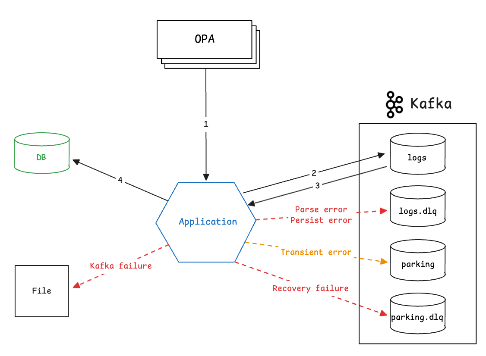
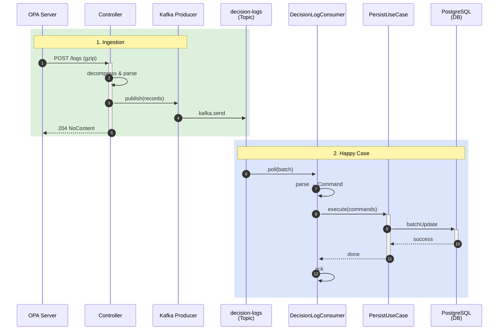
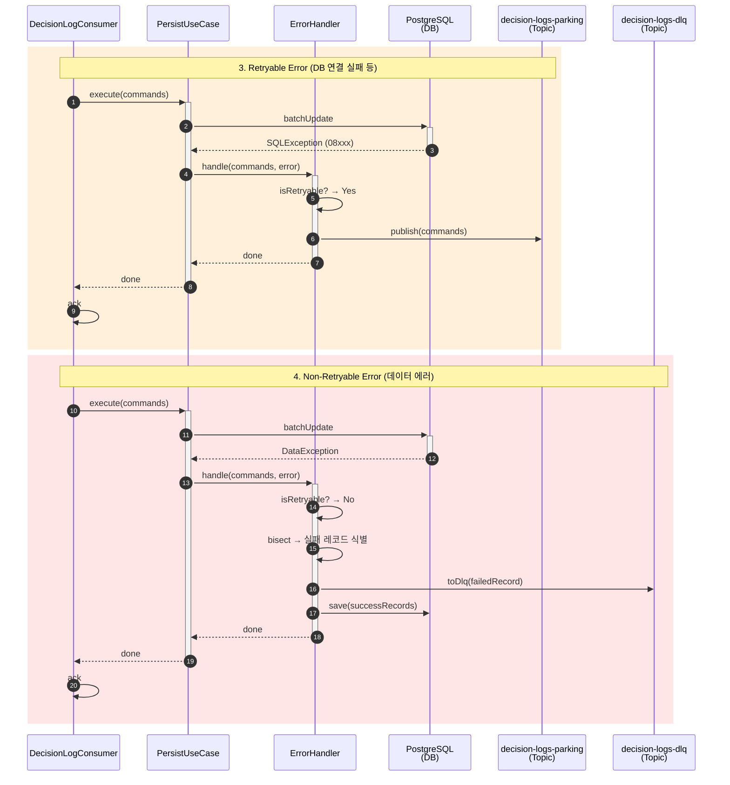
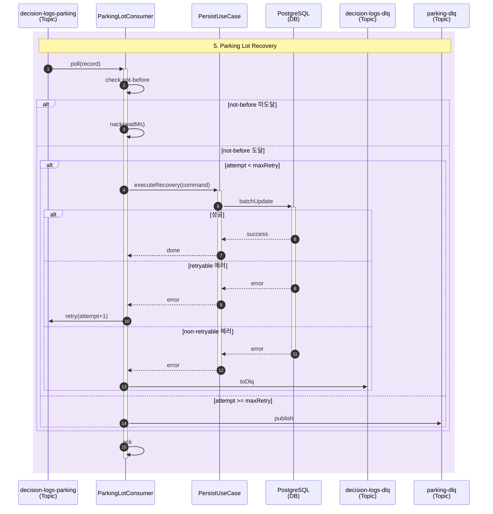

# Policy Decision Log

> OPA(Open Policy Agent) Decision Log 수집 및 분석 시스템

Zero Trust 환경에서 "접근이 왜 거부되었는가?"를 빠르게 파악하기 위한 Decision Log 파이프라인입니다.

---

## 프로젝트 배경

Zero Trust POC 백엔드를 디버깅하는 과정에서, OPA가 생성하는 정책 평가 로그를 단순히 저장만 하고 있어 다음과 같은 문제가 있었습니다:

- 접근 거부 시 **어떤 정책이 Deny를 반환했는지** 파악이 어려움
- 대량의 raw JSON 로그에서 **의미 있는 정보 추출**에 시간 소요
- 장애 상황에서 **로그 유실 가능성** 존재

이 프로젝트는 이러한 문제를 해결하기 위해 설계되었습니다.

---

## 주요 기능

### 1. Decision Log 수집
- OPA에서 gzip 압축된 Decision Log를 HTTP로 수신
- Kafka를 통한 비동기 처리로 빠른 응답
- JDBC Batch Insert로 고성능 저장

### 2. DecisionContext 조회
- raw JSON에서 거부 사유(Reasons), 정책 결과(Policies) 추출
- 서비스별 추출 로직 분리 (Strategy + Registry 패턴)
- Cursor 기반 페이징으로 대용량 조회 지원

### 3. 장애 복구 (Error Handling)
- **에러 분류**: Retryable(인프라) vs Non-retryable(데이터) 자동 판별
- **Parking Lot 패턴**: 인프라 에러 시 지수 백오프로 재시도
- **Divide and Conquer**: 배치 내 실패 레코드만 격리, 정상 레코드는 저장
- **Fallback**: Kafka 장애 시 로컬 파일 백업

---

## 아키텍처

### 시스템 구조



### 정상 흐름



### 에러 처리 흐름



### Parking Lot 복구 흐름



### 헥사고날 아키텍처


### 패키지 구조

```
policy-decision-log/
├── command/                    # 수집 (Write)
│   ├── api/                    # Controller, DTO, Mapper
│   ├── app/
│   │   ├── usecase/            # PersistDecisionLogUseCase
│   │   ├── port/               # DecisionLogPersistence, ParkingLotPublisher
│   │   ├── dto/                # DecisionLogIngestCommand
│   │   └── error/              # ErrorHandler, ErrorClassifier
│   └── infra/                  # Kafka, DB, File Adapter
│
├── query/                      # 조회 (Read)
│   ├── api/                    # Controller, Response DTO
│   ├── app/
│   │   ├── usecase/            # DecisionLogQueryService
│   │   ├── port/               # DecisionLogQueryRepository
│   │   ├── dto/                # DecisionContext, ReadModel
│   │   └── extractor/          # Strategy 패턴
│   └── infra/                  # QueryDSL Repository
│
└── shared/                     # 공통
    ├── config/                 # Kafka, QueryDSL 설정
    ├── metrics/                # Prometheus 메트릭
    └── exception/              # 공통 예외
```

---

## 프로젝트 구조

```
learners-high-decision-context/
├── policy-decision-log/        # 메인 애플리케이션
├── docs/
│   ├── adr/                    # Architecture Decision Records
│   ├── tech/                   # 기술 노트
│   ├── data/                   # 샘플 데이터
│   ├── diagram/                # Mermaid 다이어그램
│   └── image/                  # 아키텍처 이미지
├── docker-compose.yml          # 인프라 (Kafka, PostgreSQL)
└── docker-compose.observability.yml  # 모니터링 (Prometheus, Grafana)
```

---

## 기술적 의사결정 (ADR)

| ADR | 주제 |
|-----|------|
| [ADR007](docs/adr/ADR007-kafka-event-stream.md) | 비동기 처리 |
| [ADR009](docs/adr/ADR009-dlq-error-handling.md) | 에러 처리 |
| [ADR011](docs/adr/ADR011-kafka-producer-strategy.md) | Producer 전략 |
| [ADR013](docs/adr/ADR013-parking-lot-recovery.md) | 장애 복구 |

---

## 기술 스택


---

## 실행 방법

### 1. 인프라 실행

```bash
docker-compose up -d
```

### 2. 애플리케이션 실행

```bash
./gradlew bootRun
```

### 3. API 테스트

```bash
# Decision Log 수집 (샘플 파일 사용)
gzip -c docs/data/decision_log.json | curl -X POST http://localhost:8080/logs \
  -H "Content-Type: application/json" \
  -H "Content-Encoding: gzip" \
  --data-binary @-

# DecisionContext 조회
curl http://localhost:8080/decisions/9d258b04-142c-4033-b5b6-cb01c08ef8cf/context
```

---

## 모니터링

### 주요 메트릭

| 패널 | 메트릭 | 설명 |
|------|--------|------|
| Ingest TPS | `decision_log_ingest_total` | HTTP 수신 처리량 |
| Publish TPS | `decision_log_publish_success_total`<br/>`decision_log_publish_failure_total` | Kafka 발행 성공/실패 |
| DB Save TPS | `decision_log_db_save_success_total`<br/>`decision_log_db_save_failure_total` | DB 저장 성공/실패 |
| DB Save Retry | `decision_log_db_save_retry_total` | DB 저장 재시도 횟수 |
| Consume Processing Time | `decision_log_consume_process_time_seconds` | Kafka 배치 처리 시간 |
| DLQ / Parking Throughput | `decision_log_dlq_sent_total`<br/>`decision_log_parking_sent_total`<br/>`decision_log_parking_recovered_total`<br/>`decision_log_parking_dlq_sent_total` | DLQ/Parking 처리량 |
| E2E Latency | `decision_log_e2e_latency_seconds` | 수신~저장 지연 시간 |

### Grafana 대시보드

```
http://localhost:3000
```

---

## 참고 자료

- [OPA Decision Log](https://www.openpolicyagent.org/docs/latest/decision-logs/)
- [Hexagonal Architecture](https://tech.osci.kr/hexagonal-architecture/)
- [CQRS Pattern - Microsoft](https://learn.microsoft.com/en-us/azure/architecture/patterns/cqrs)
