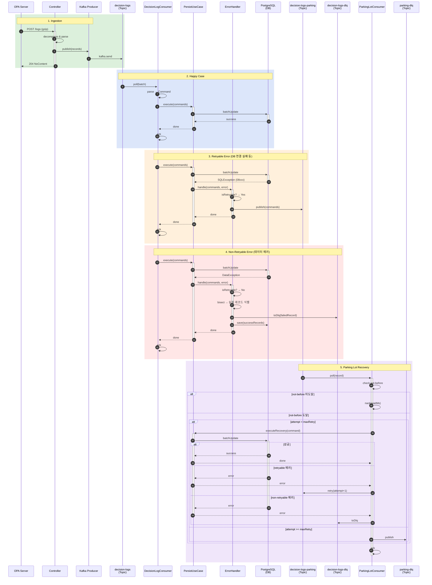

# Decision Log Flow - Sequence Diagram

## 흐름 설명

### 1. Ingestion (수집)
- OPA Server가 gzip 압축된 Decision Log를 HTTP POST로 전송
- Controller가 압축 해제 후 Kafka로 발행
- 비동기 처리로 빠른 응답 (204 No Content)

### 2. Happy Case (정상 처리)
- Kafka Consumer가 배치 단위로 메시지 소비
- UseCase를 통해 DB에 배치 저장
- 성공 시 offset commit (ack)

### 3. Retryable Error (재시도 가능 에러)
- DB 연결 실패, 타임아웃, 데드락 등
- ErrorHandler가 Parking Lot 토픽으로 발행
- 지수 백오프로 재시도 예정

### 4. Non-Retryable Error (재시도 불가 에러)
- 파싱 에러, 데이터 무결성 에러 등
- Bisect 알고리즘으로 실패 레코드만 식별
- 실패 레코드는 DLQ로, 정상 레코드는 DB에 저장

### 5. Parking Lot Recovery (복구)
- not-before 시간까지 대기 후 재시도
- 최대 재시도 횟수 초과 시 Parking DLQ로 이동
- 성공 시 복구 완료, 실패 시 다음 attempt로 재발행
